# sagemaker-tf-handson-with-byoc-preprocess-and-byom-hosting
## 概要
* 本ハンズオンを実施することで下記を学べます。
    * [SageMaker Processing の独自コンテナを用いた前処理の動かし方](./1_preprocess_kick.ipynb)
    * [TensorFlow2 を用いた SageMaker Training のやり方](./2_tf_mnist_train.ipynb)
    * [ユーザが事前に TensorFlow2 で作成したモデルを SageMaker Hosting を利用してホスティングするやり方と推論の仕方](./3_byom.ipynb)
* 注）AWS アカウントが事前に必要です。また、サービスクオータの緩和申請が事前に必要なことがあります。
* 2020/12/23時点で動作することを確認しています。

{アカウント番号(12桁の数字)}.signin.aws.amazon.com/console にブラウザ(chrome/firefox
推奨)でアクセスし、ご自身のIAMユーザとパスワードを入力し、「サインイン」をクリックします。

---
## 手順

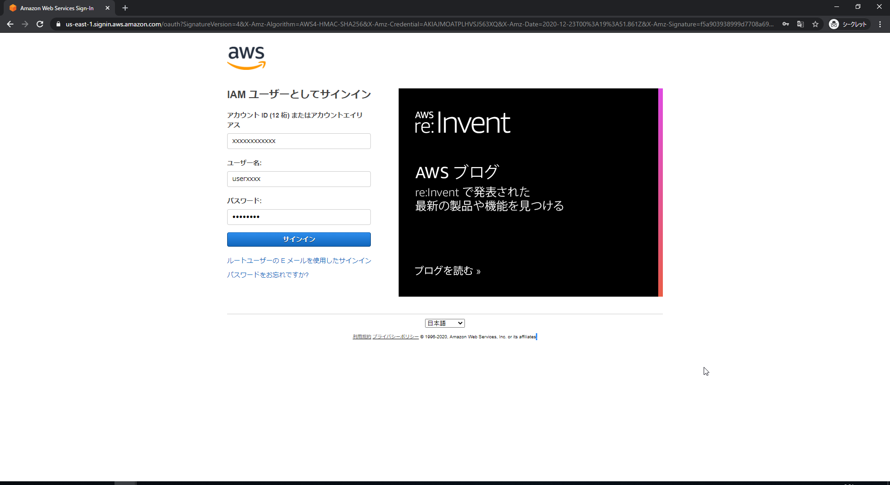上部中央の検索窓に「sage」と入力すると「Amazon SageMaker」 のリンクが表示されますのでクリックします。

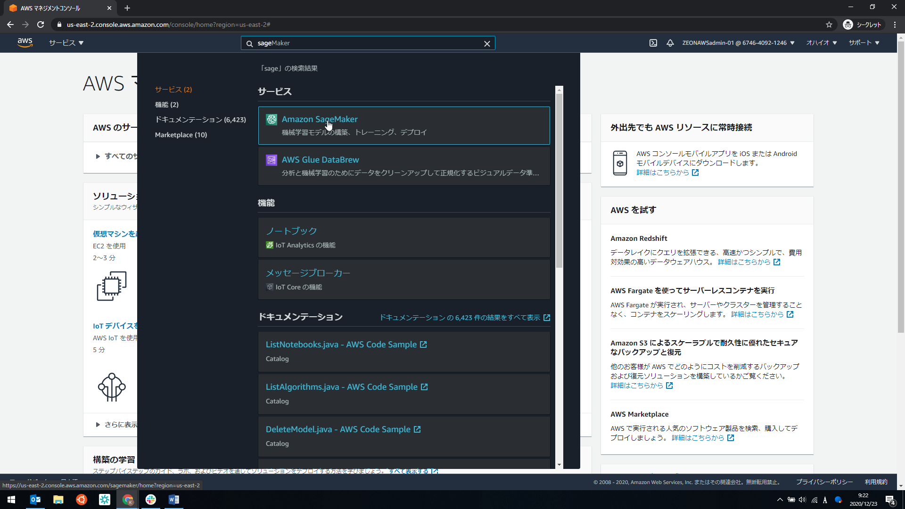

右上にある地域名が書かれたところが東京になっていない場合は、その場所をクリックして、東京をクリックします。

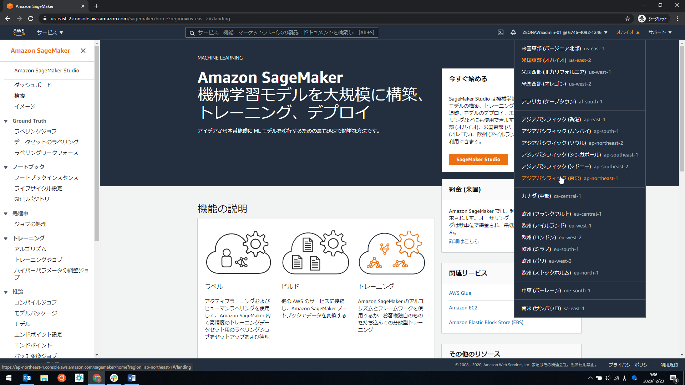

左側のペインにある「ノートブックインスタンス」というリンクをクリックします。

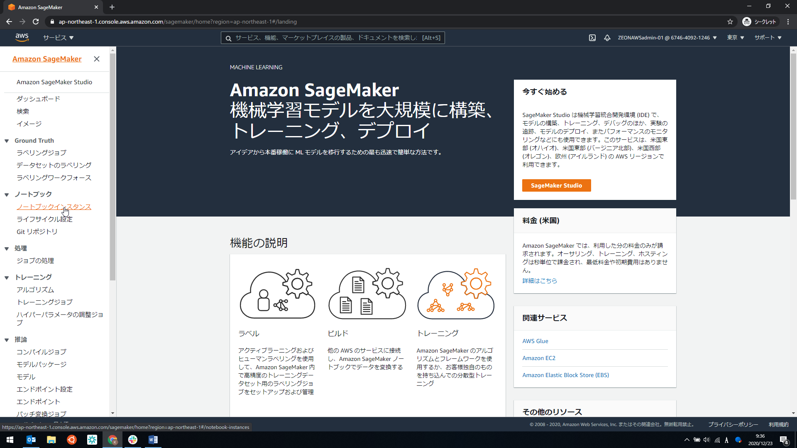

右上の「ノートブックインスタンスの作成」というリンクをクリックします。

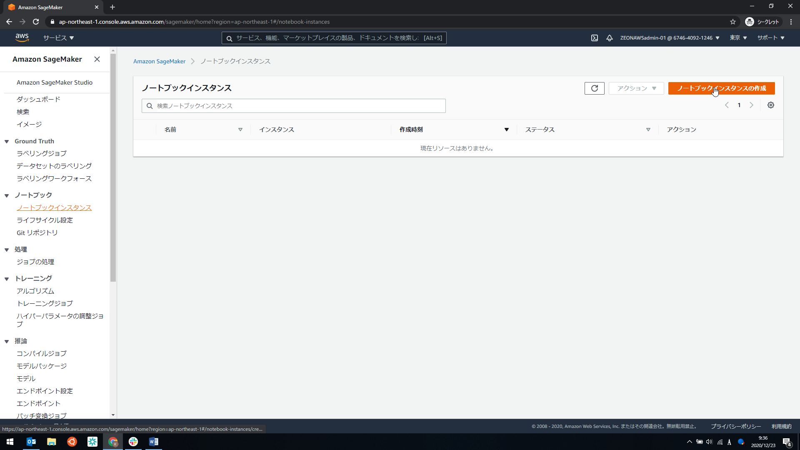これから作成するノートブックインスタンスの設定を行います。下記を設定ください。

ノートブックインスタンス名 : AWSアカウント内で一意になるように設定。ex:){name}-handson-YYYYMMDD

ノートブックインスタンスのタイプ : ml.c5.xlarge (CPUが高性能)

IAMロール : IAM ロールを選択、と書かれたプルダウンをクリックし、新しいロールの作成をクリックする。

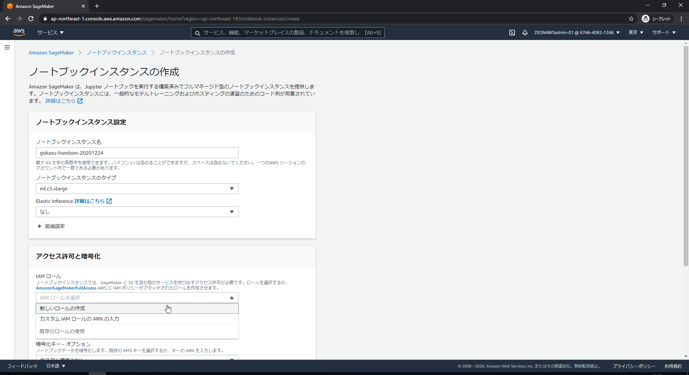

任意のS3バケットのラジオボタンが選択されていることを確認の上、「ロールの作成」をクリックする。

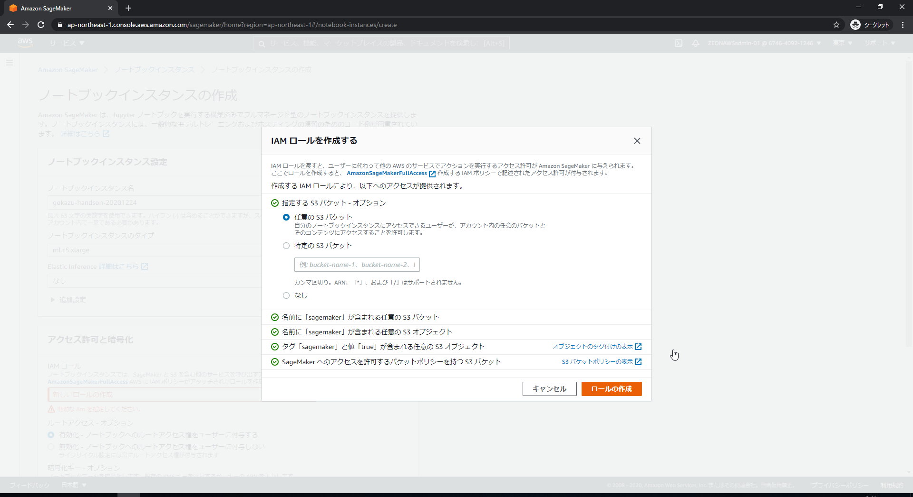

「Gitリポジトリ」をクリックする。

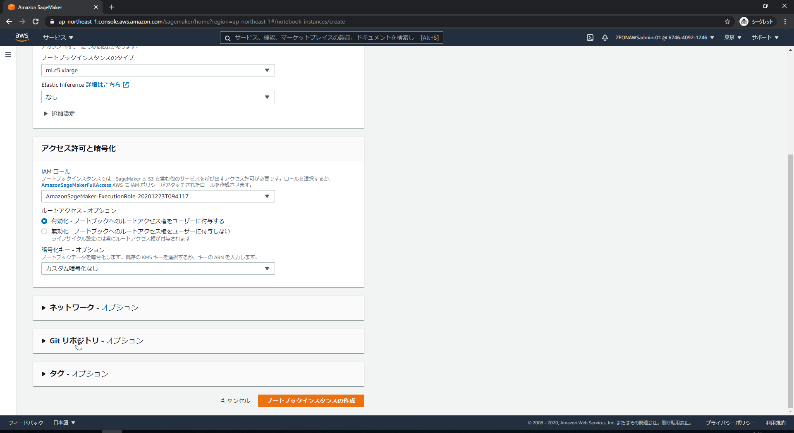

「なし」と表示されたプルダウンをクリックし、「このノートブックインスタンスのみにパブリックGitリポジトリのクローンを作成する」をクリックする。

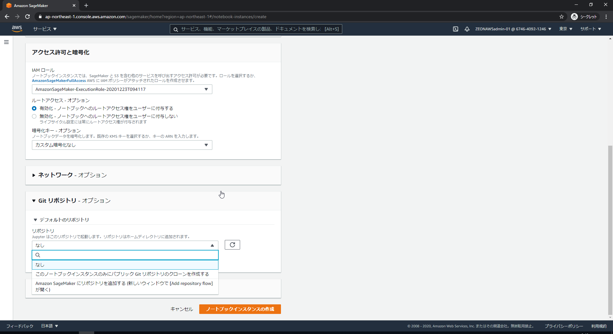

「Git リポジトリの URL のテキストボックスに、<https://github.com/kazuhitogo/sagemaker-tf-handson-with-byoc-preprocess-and-byom-hosting>を入力し、「ノートブックインスタンスの作成」をクリック。

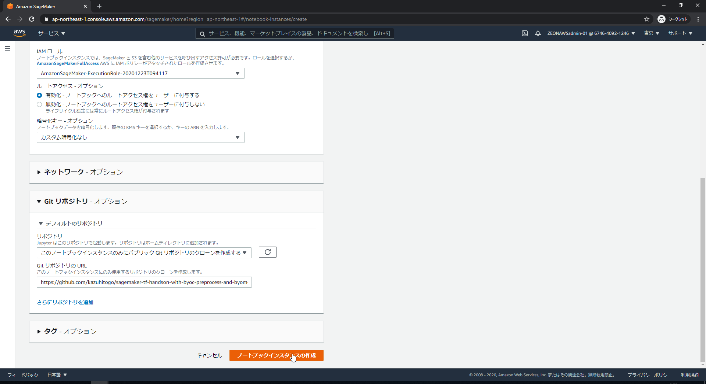

上部に「成功！～～」と表示され、ステータスが Pending または InProgress になっていればOKです。しばらく待ちます。

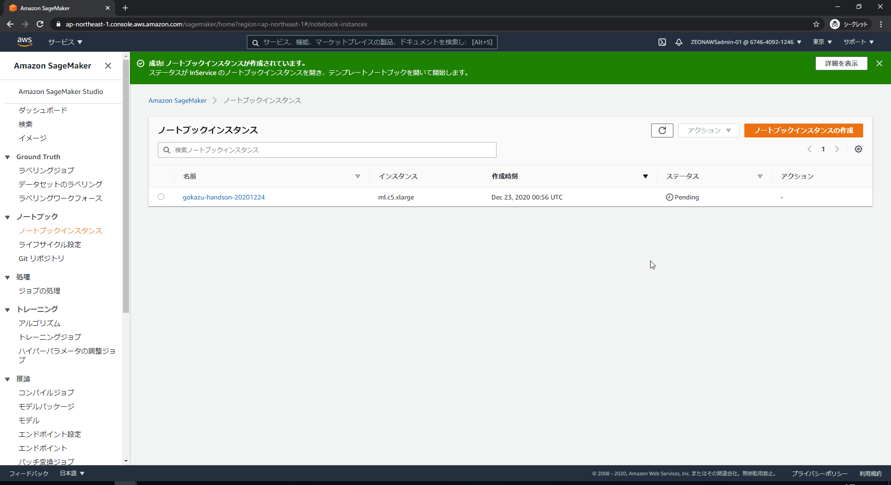

ステータスが InService に変わりましたら、「 Jupter を開く」をクリックします。

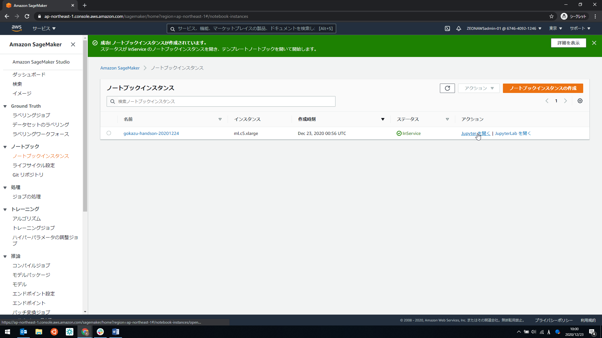

「config.yaml」をクリックします。

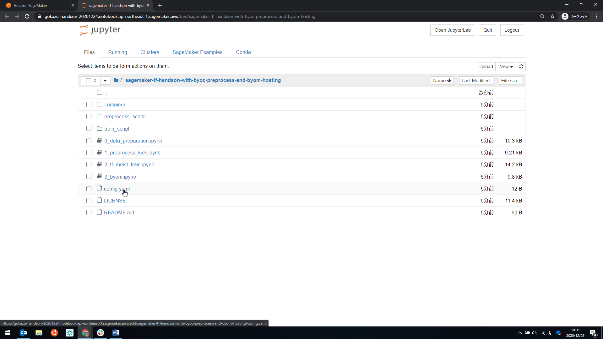

ご自身の内容を入力し、保存します。保存は File -> Saveでも、(Winの場合) ctrl + s でも可能です。完了したらそのタブは閉じて構いません。

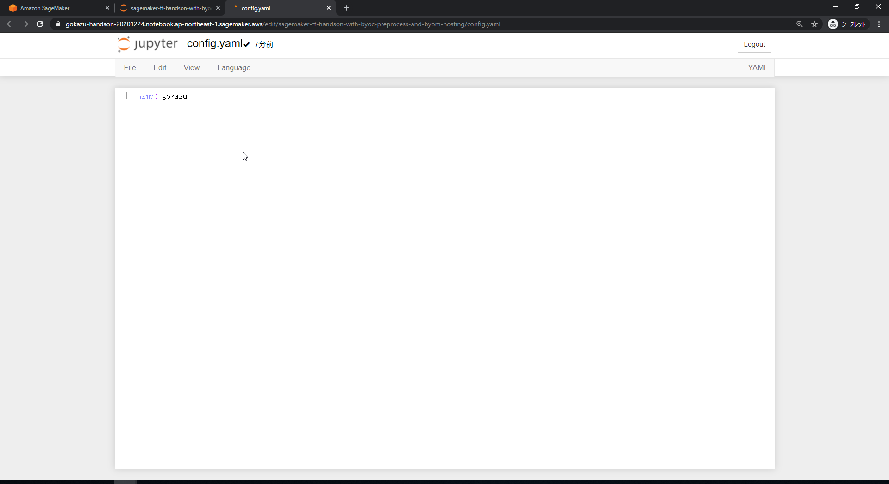

以降、0_data_preperation.ipynb, 1_preprocess_kick.ipynb, 2_tf_mnist_train.ipynb, 3_byom.ipynb の順番に実行していきます。各ノートブックに記載されている中身を参照ください。

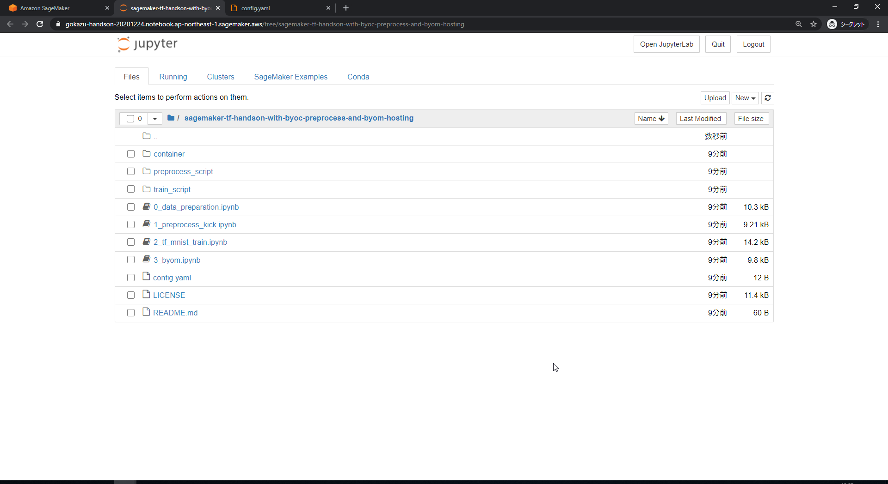
